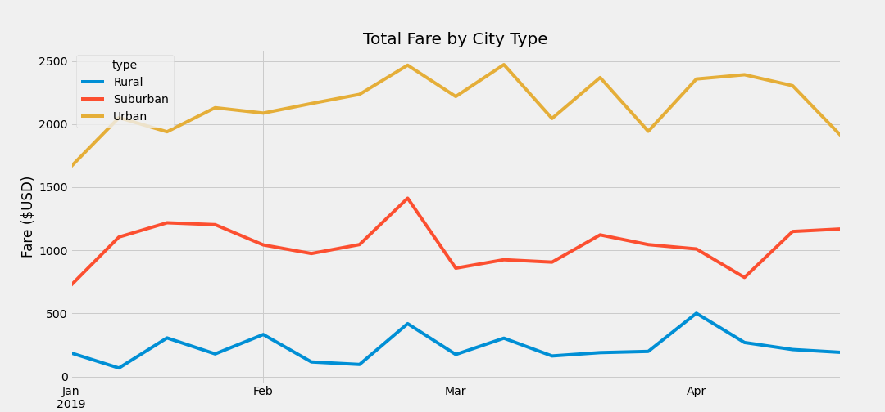

# PyBer Analysis

## Overview

The purpose of this project was to help the decision making at _PyBer_, a billion dollar ride-sharing company. This project analyses ride-sharing data from different city types, including fares and number of drivers and gives a clear snapshot into the current state of the operations. This information will be used to makes decisions regarding fares, business expansion and budget allocation.

## Results

After managing the data and performing multiple calculations, the following summary was created to better understand the key differences from city type:

The key findings were the following:

- As there is less supply, prices go up. Each rural driver made on average **1.6** rides while that same number was **.67** rides for the urban driver. This means there is an oversupply of urban driver, possibly driving the fares down
- Having so many drivers in urban cities is not efficient since it is pushing prices down and not even every driver is driving as per the data indicating only .67 rides per driver.

- The average fare per urban driver is roughly a third from those in rural areas, while the ones from suburban drivers sit in the middle. This again can be correlated to the supply from each city type.

- In terms of business, the most important city type since it contributes **63%** percent of all income. Conversely, rural and suburban types contribute **7%** and **30%**, respectively. This means that any adjustment in the urban fares will have a dramatic impact on the top line of _PyBer_.

The following line chart will help to visually understand the differences between the three city types.

The key findings are the following:

- Even though the average rural fare is approximately **3** times more than the urban fares, its contribution to income is **9** times less than what the urban type contributes.
- There is a marked seasonality on the income. Visually, it is not difficult to see that there are times of the year the income from the different city types behaves in the same way. For example, just before the end of February there is a sharp upturn in total fares.
- If there was not an oversupply of driver in urban cities, urban contribution to income would likely be higher.

## Summary

There are a lot of decisions that may be taken based on these findings. The following are the decisions that we recommend making:

- Increase the number of rural drivers only if there is enough projected demand. This would cause the prices to go down but number of rides to go up. Out of the three city types, the people with the lowest income is the one in rural areas, thus making the high prices even more inaccessible.
- Decrease the number of drivers in urban areas. This will increase the average fare and productivity per driver. Based on the number, on average in urban areas a driver is not even completing one drive. If the company is paying a salary, this means that a lot of money is going overspent.
- Push a greater expansion into suburban city types. The efficiency per driver is much greater than in urban city types and the fare is almost 20% above.
- I would request management not only for sales data, but for profit data per city type in order to make any definitive decisions. While sale data is better than nothing, it is imperative to analyze how profitable each type is.
